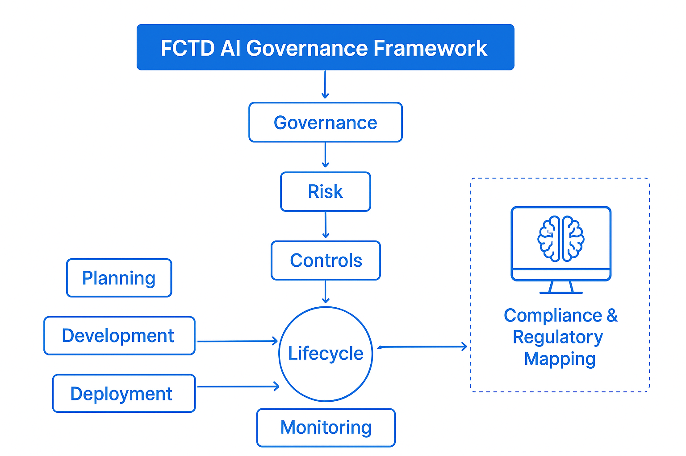

# 🏛️ FCTD AI Governance Framework

Selamat datang di **From Compliance To Dominant (FCTD) AI Governance**.  
Dokumentasi ini memuat prinsip, risiko, kontrol, siklus hidup model, dan template yang dipakai FCTD untuk tata kelola AI.

  

---

## 📖 Ringkasan
Framework ini terinspirasi dari FINOS AI Governance Framework, dengan penyesuaian ke konteks FCTD dan regulasi lokal (UU PDP, ISO/IEC 42001, dsb).  
Tujuannya: memastikan solusi AI aman, transparan, patuh hukum, dan bernilai bisnis.

---

## 📂 Struktur Dokumentasi
### 1. Governance
- [Principles](governance/principles.md)  
- [Roles & Responsibilities](governance/roles-and-responsibilities.md)  
- [Operating Model](governance/operating-model.md)  

### 2. Risk & Controls
- [Risk Register](risk/risk-register.md)  
- Risks: [Hallucination](risk/risks/hallucination.md) • [Data Leakage](risk/risks/data-leakage.md) • [Model Drift](risk/risks/model-drift.md)  
- Controls: [Prompt Management](risk/controls/prompt-management.md) • [PII Redaction](risk/controls/pii-redaction.md) • [Human-in-the-Loop](risk/controls/human-in-the-loop.md)  

### 3. Lifecycle
- [Ideation Checklist](lifecycle/ideation-checklist.md)  
- [Data Governance](lifecycle/data-governance.md)  
- [Model Development](lifecycle/model-development.md)  
- [Evaluation](lifecycle/evaluation.md)  
- [Deployment](lifecycle/deployment.md)  
- [Monitoring](lifecycle/monitoring.md)  

### 4. Templates
- [AI Impact Assessment](templates/ai-impact-assessment.md)  
- [Model Card](templates/model-card.md)  
- [Data Sheet](templates/data-sheet.md)  
- [Red Teaming Report](templates/red-teaming-report.md)  

### 5. Examples
- [AIA: Customer Support RAG](examples/use-cases/customer-support-rag/aia.md)  
- [Model Card: Customer Support RAG](examples/use-cases/customer-support-rag/model-card.md)  

---

## 🚀 Next Steps
1. Review risiko utama dan kontrol prioritas.  
2. Lengkapi AIA & Model Card untuk setiap use case baru.  
3. Gunakan checklist Go-Live di PR rilis.  
4. Pantau metrik & audit berkala.  

---

> ✨ Dokumentasi ini dibangun dengan [MkDocs](https://www.mkdocs.org/) dan otomatis dipublikasikan ke **GitHub Pages**.
# FCTD AI Governance

Wed Aug 20 18:19:53 WIB 2025
