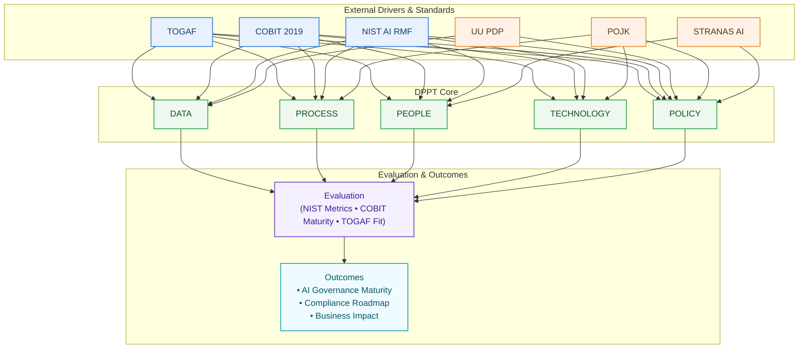

# 🧭 Research Framework (DPPT ↔ Frameworks ↔ Regulasi)

Dokumen ini menampilkan diagram visual kerangka penelitian yang menyelaraskan **DPPT** dengan **TOGAF, COBIT, NIST AI RMF** dan **UU PDP, POJK, STRANAS AI**.

## Diagram (Mermaid)

