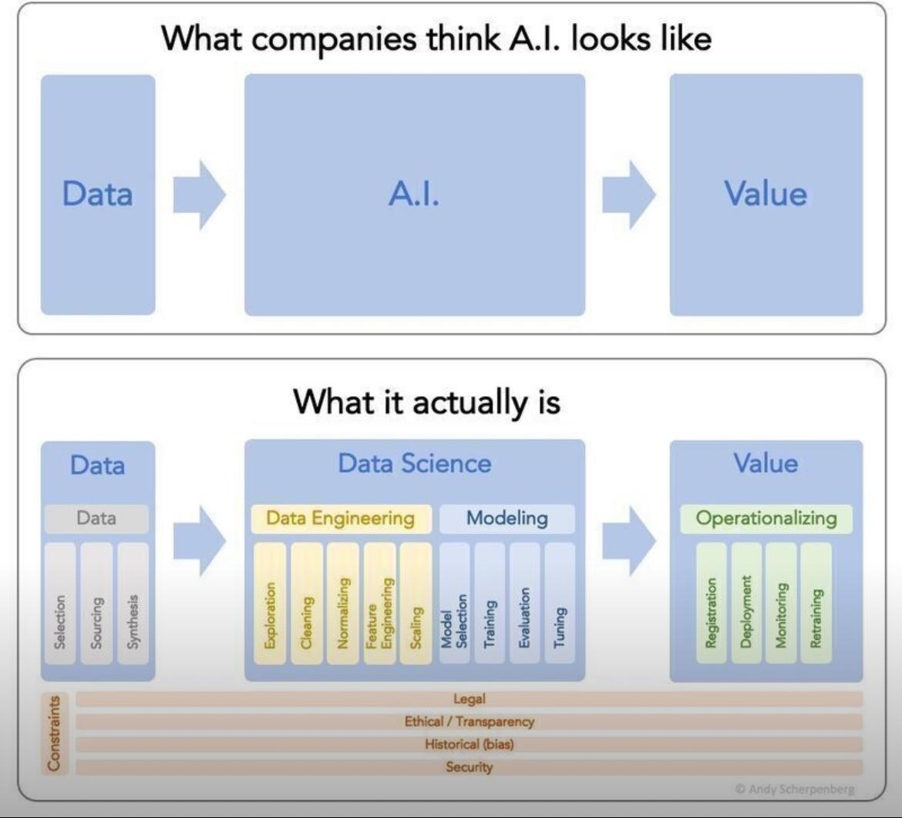

# 📊 Framework Diagram

Framework ini mengikuti standar AI governance seperti **NIST AI RMF** [@NIST2023], **TOGAF** [@TOGAF2018], dan **COBIT** [@COBIT2019].  
Penerapan AI di Indonesia wajib selaras dengan **UU PDP** [@UUPDP2022], **POJK** [@POJK2016], dan **STRANAS AI** [@STRANASAI].

---
## 📷 Ilustrasi: AI dalam Praktik

**AI: Persepsi vs Realita**  
  { width="600" }  
  *"What companies think AI looks like" vs kenyataan (Data → DS/ML → Business Value) dengan constraint LEGAL / ETHICS / SECURITY.*

🔎 Diagram

```mermaid
flowchart TD
  %% ====== Groups ======
  subgraph Drivers["External Drivers & Standards"]
    A["TOGAF"]:::std
    B["COBIT 2019"]:::std
    C["NIST AI RMF"]:::std
    U["UU PDP"]:::law
    J["POJK"]:::law
    S["STRANAS AI"]:::law
  end

  subgraph Core["DPPT Core"]
    D["DATA"]:::pill
    P["PROCESS"]:::pill
    E["PEOPLE"]:::pill
    T["TECHNOLOGY"]:::pill
    Y["POLICY"]:::pill
  end

  subgraph Eval["Evaluation & Outcomes"]
    V["Evaluation (NIST Metrics · COBIT Maturity · TOGAF Fit)"]:::eval
    O["Outcomes: AI Governance Maturity · Compliance Roadmap · Business Impact"]:::out
  end

  %% ====== Mappings ======
  A --> D & P & E & T & Y
  B --> D & P & E & T & Y
  C --> D & P & E & T & Y
  U --> D & Y
  J --> P & T & Y
  S --> P

  D & P & E & T & Y --> V --> O

  %% ====== Styles ======
  classDef std fill:#e8f1ff,stroke:#2f7de1,stroke-width:1.2px,color:#173b6b;
  classDef law fill:#fff1e6,stroke:#e18a2f,stroke-width:1.2px,color:#5a3410;
  classDef pill fill:#eef8ef,stroke:#2ea44f,stroke-width:1.2px,color:#0f4d1f;
  classDef eval fill:#f5f0ff,stroke:#6e40c9,stroke-width:1.2px,color:#3b1d91;
  classDef out fill:#f0fbff,stroke:#0aa2c0,stroke-width:1.2px,color:#035766;

  style Drivers rx:8,ry:8
  style Core    rx:8,ry:8
  style Eval    rx:8,ry:8
```

## Referensi
\full_bibliography