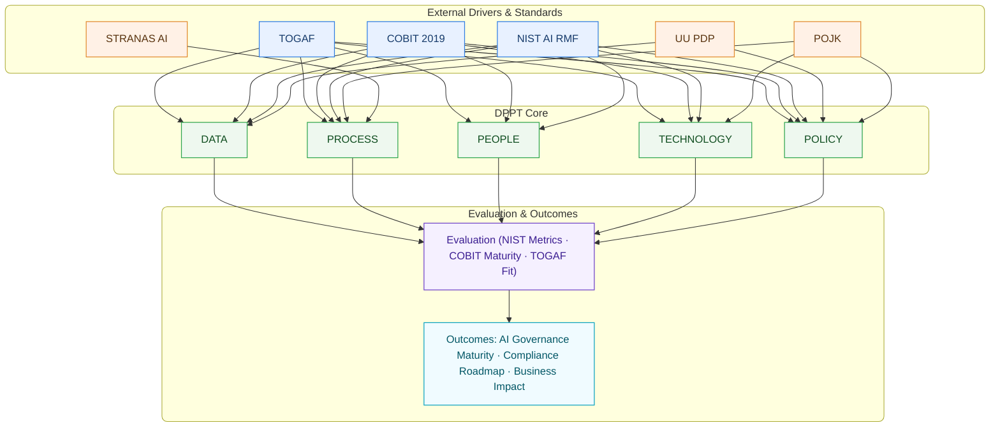

# 📊 Framework Diagram

Framework ini mengikuti standar AI governance seperti **NIST AI RMF** [@NIST2023], **TOGAF** [@TOGAF2018], dan **COBIT** [@COBIT2019].  
Penerapan AI di Indonesia wajib selaras dengan **UU PDP** [@UUPDP2022], **POJK** [@POJK2016], dan **STRANAS AI** [@STRANASAI].

---

## 🎯 1. Latar Belakang & Rasional
Kerangka ini menggabungkan **DPPT** (Data, Process, People, Technology, Policy) dengan **TOGAF**, **COBIT 2019**, **NIST AI RMF**, serta **UU PDP / POJK / STRANAS AI** untuk memastikan tata kelola AI yang **selaras tujuan bisnis, terukur risikonya, dan patuh regulasi**. Tujuan riset: membuktikan bahwa alignment lintas-kerangka menaikkan **governance maturity**, **compliance readiness**, dan **business impact**.

## ❓ 2. Pertanyaan Riset
1) Seberapa fit kapabilitas **DPPT** terhadap kontrol/objektif **TOGAF/COBIT/NIST**?  
2) Bagaimana alignment tersebut memetakan persyaratan **UU PDP/POJK/STRANAS**?  
3) Apakah alignment & kapabilitas **DPPT** berkorelasi dengan **business impact** dan penurunan risiko?

## 🧩 3. Model Konseptual
**Input/Drivers:** standar & regulasi (TOGAF/COBIT/NIST/UU PDP/POJK/STRANAS).  
**Kapabilitas Inti (DPPT):** kualitas data, maturitas proses, kompetensi & budaya, kesiapan teknologi, dan kebijakan.  
**Mekanisme Tata Kelola:** arsitektur & portofolio (**TOGAF**), objective **COBIT**, fungsi **NIST AI RMF** (Govern/Map/Measure/Manage).  
**Outcome:** AI Governance Maturity, Compliance Readiness, Business Impact.

## 🔗 4. Pemetaan DPPT × Kerangka × Regulasi (Ringkas)

| DPPT | TOGAF (ADM/Domain) | COBIT 2019 (contoh) | NIST AI RMF (fungsi) | Regulasi (contoh) | Evidence kunci |
|---|---|---|---|---|---|
| **Data** | Data Architecture; ADM B/C | APO14 (Data Mgmt), APO03, BAI03 | Map (context), Measure (data quality/bias) | UU PDP (lawful basis, minimization), POJK (data governance) | Data catalog, lineage, DQ KPI, DPIA, RoPA |
| **Process** | Business Architecture; Req Mgmt; Gov (Ph G) | APO01, BAI02/03, DSS01 | Manage (mitigation), Govern (policies) | POJK MR (ERM & IT Risk), UU PDP (privacy by design) | SOP, AI risk register, change/release, incident/DR |
| **People** | Org Change Mgmt (G/H), Stakeholder Mgmt | APO07 (HR), APO01 (Roles), MEA | Govern (roles), Map (stakeholders) | STRANAS AI (talenta), UU PDP (pelatihan PII) | RACI, Komite AI, pelatihan, CoE |
| **Technology** | Tech Architecture; SBB | BAI06 (Change), DSS05 (Security), APO12 (Risk) | Measure (model eval), Manage (controls) | POJK TIK (security/reliability), UU PDP (security) | Model cards, eval reports, MLOps, security controls |
| **Policy** | Architecture Governance; Compliance | EDM01–03, APO13, MEA | Govern (policy/process), Manage (controls) | UU PDP (DPO, kebijakan PII), POJK (kebijakan TI/risiko) | AI/Data policy, DPIA std, retention, audit trail |

> Intinya: **DPPT = kapabilitas**; **TOGAF/COBIT/NIST = mekanisme & kontrol**; **regulasi = constraint** yang wajib dipenuhi.

## 🧭 5. Prinsip Tata Kelola (Policy Layer)
Lawfulness & Transparency; Risk-based & Proportional; Accountability (three lines of defense); Privacy & Security by Design; Fairness & Robustness; Auditability.

## 🏢 6. Struktur Organisasi & RACI (ringkas)
- **Board/Komite** → EDM (arah & oversight).  
- **CIO/CTO/CDAO** → APO/BAI/DSS (kebijakan–arsitektur–eksekusi).  
- **Head of AI/ML** → lifecycle (Map/Measure/Manage).  
- **DPO/Legal/Compliance** → UU PDP (DPIA, RoPA, kontrak).  
- **CISO/SecOps** → security & incident response; **Audit Internal** → MEA.

Contoh RACI: **DPIA** (R=DPO/Legal, A=CDAO), **Model Release** (R=Head of AI, A=CTO), **Incident** (R=CISO, A=CIO).

## 🔄 7. Proses Siklus Hidup (selaras NIST AI RMF)
Inisiasi & Mapping → Desain & Data → Pengembangan & Evaluasi → Persetujuan & Rilis → Operasi & Monitoring → Review & Retire.  
Tiap fase dirujukkan ke **TOGAF ADM**, **COBIT**, dan fungsi **NIST** (G/M/M/M).

## 📏 8. Metrik & Evidensi
Data (completeness/accuracy/imbalance), Process (SLA change/release, temuan audit), People (coverage pelatihan/role), Technology (RMSE/MAE/R², drift), Policy (jumlah DPIA, exceptions).  
**Outcome KPI:** AI Governance Maturity, Compliance Readiness, Business Impact.

## 🧪 9. Hipotesis
H1: DPPT ↗ → AI Governance Maturity ↗.  
H2: Pemetaan DPPT↔NIST menurunkan AI Risk & meningkatkan Compliance Readiness.  
H3: Governance Maturity ↗ → Business Impact ↗.  
H4: Regulatory fit memperkuat pengaruh DPPT terhadap outcome.

## 🛠️ 10. Rencana Operasionalisasi
Instrumen (readiness DPPT, checklist compliance, log MLOps), skala Likert 1–5, analitik (clustering, regresi, uji beda, reliabilitas α, k-fold), serta evidensi (model card, DPIA, kebijakan, SOP, artefak audit/monitoring).

---

## 🗺️ Diagram (Mermaid)

